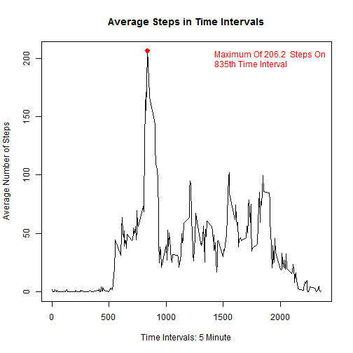
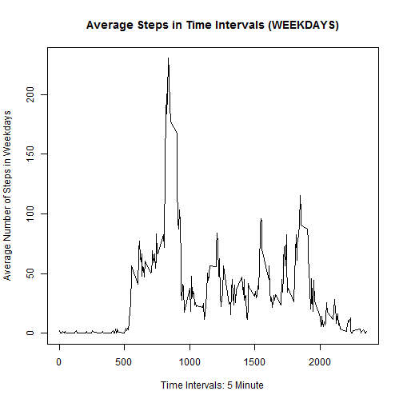
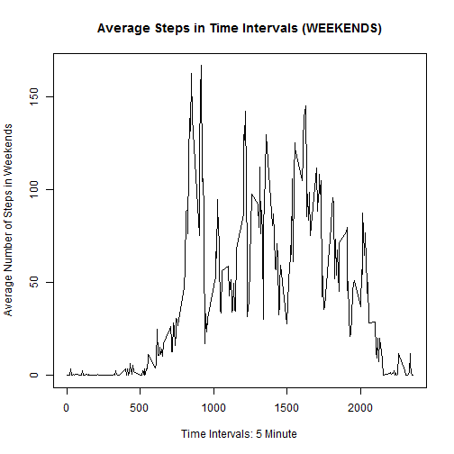

## Loading and preprocessing the data

The data for this assignment has be downloaded from the course web site:
  
[Activity monitoring data](https://d396qusza40orc.cloudfront.net/repdata%2Fdata%2Factivity.zip)
The variables included in this dataset are:
  
- steps: Number of steps taking in a 5-minute interval (missing values are coded as NA)
- date: The date on which the measurement was taken in YYYY-MM-DD format
- interval: Identifier for the 5-minute interval in which measurement was taken

The dataset is stored in a comma-separated-value (CSV) file and there are a total of 17,568 observations in this dataset.


```r
setwd("D:/Data Science/Reproducible Research/peer assessment 1")
data<-read.csv('activity.csv', header = TRUE)
```

```
## Warning in file(file, "rt"): cannot open file 'activity.csv': No such file
## or directory
```

```
## Error in file(file, "rt"): cannot open the connection
```

```r
data<-data.table(data)
```

```
## Error in eval(expr, envir, enclos): could not find function "data.table"
```

```r
head(data)
```

```
##   steps       date interval
## 1    NA 2012-10-01        0
## 2    NA 2012-10-01        5
## 3    NA 2012-10-01       10
## 4    NA 2012-10-01       15
## 5    NA 2012-10-01       20
## 6    NA 2012-10-01       25
```

```r
data$date<- as.Date(data$date)
```


## What is mean total number of steps taken per day?

I generalize this histogram plot into a Function to be Re-usable later

```r
hist_steps = function(x){
  hist(x, breaks = 30, 
       main = 'Number of Steps Taken Per Day', 
       xlab = 'Total Number of Steps', col = 'blue',
       cex.main = .9)
  
  #caluclate mean and median
  mean_steps = round(mean(x), 2)
  median_steps = round(median(x), 2)
  
  #place lines for mean and median on histogram
  abline(v=mean_steps, lwd = 3, col = 'green')
  abline(v=median_steps, lwd = 3, col = 'red')
  
  #create legend
  legend('topright', lty = 1, lwd = 3, col = c("green", "red"),
         cex = 1, 
         legend = c(paste('Mean: ', mean_steps),
                    paste('Median: ', median_steps))
  )
}
newdata<-na.omit(data)
## Calculate the total number of steps taken per day
steps_day<- as.numeric(tapply(newdata$steps, newdata$date, sum))

hist_steps(steps_day)
```

 


## What is the average daily activity pattern?


```r
data$interval <- as.factor(data$interval)
steps_avg <- as.numeric(tapply(data$steps, data$interval, mean, na.rm = TRUE))
intervals <- data.frame(intervals = as.numeric(levels(data$interval)), steps_avg)
intervals <- intervals[order(intervals$intervals), ]

##plot the time series

 plot(intervals$interval, intervals$steps_avg, type = 'l',
       main = 'Average Steps in Time Intervals',
       xlab = 'Time Intervals: 5 Minute',
       ylab = 'Average Number of Steps')
## Find Interval That Has The Maximum Avg Steps
steps_max <- intervals[which.max(intervals$steps_avg),]

#Generate Label String
max_lab = paste('Maximum Of ', round(steps_max$steps_avg, 1), '  Steps On \n',
                round(steps_max$intervals, 1) , 'th Time Interval', sep = '')

#Collect Cooridinates of The Max Interval For Graphing
points(steps_max$intervals,steps_max$steps_avg,  col = 'red', lwd = 3, pch = 19)

#Add Label To Annotate Maximum # Steps And Interval
legend("topright",
       legend = max_lab,
       text.col = 'red',
       bty = 'n'
)
```

 


## Imputing missing values

Calculate and report the total number of missing values in the dataset 


```r
sum(is.na(data$steps))
```

```
## [1] 2304
```

The strategy for replacing the missing values in the dataset is to change the “NA"s to the mean values for that 5-minute interval.

```r
steps <- vector()
for (i in 1:dim(data)[1]) {
    if (is.na(data$steps[i])) {
        steps <- c(steps, intervals$steps_avg[intervals$intervals == data$interval[i]])
    } else {
        steps <- c(steps, data$steps[i])
    }
}


nomissing<- data.frame(steps = steps, date = data$date, interval = data$interval)

# create histogram

hist(tapply(nomissing$steps, nomissing$date, sum), col="blue", xlab = "Total daily steps", breaks = 20, main = "Total of steps taken per day")

total_daily<- as.numeric(tapply(nomissing$steps, nomissing$date, sum))
new_mean_steps = round(mean(total_daily), 1)
new_median_steps = round(median(total_daily), 1)
  
#place lines for mean and median on histogram
abline(v=new_mean_steps, lwd = 3, col = 'green')
abline(v=new_median_steps, lwd = 3, col = 'red')

  legend('topright', lty = 1, lwd = 3, col = c("green", "red"),
         cex = 1, 
         legend = c(paste('Mean: ', new_mean_steps),
                    paste('Median: ', new_median_steps)))
```

 
The new mean and median of total number of steps taken per day are 10766 and 10766 respectively, the median is exactly equal to the mean. Because of the strategy chosen, there is no impact of imputing missing data on the estimates of the total daily number of steps.


## Are there differences in activity patterns between weekdays and weekends?

For this part the weekdays() function may be of some help here. Use the dataset with the filled-in missing values for this part.

Create a new factor variable in the dataset with two levels – “weekday” and “weekend” indicating whether a given date is a weekday or weekend day.

Make a panel plot containing a time series plot (i.e. type = "l") of the 5-minute interval (x-axis) and the average number of steps taken, averaged across all weekday days or weekend days (y-axis). See the README file in the GitHub repository to see an example of what this plot should look like using simulated data.


```r
nomissing$day<- c("weekend", "weekday", "weekday", 
    "weekday", "weekday", "weekday", "weekend")[as.POSIXlt(nomissing$date)$wday + 
    1]
head(nomissing)
```

```
##       steps       date interval     day
## 1 1.7169811 2012-10-01        0 weekday
## 2 0.3396226 2012-10-01        5 weekday
## 3 0.1320755 2012-10-01       10 weekday
## 4 0.1509434 2012-10-01       15 weekday
## 5 0.0754717 2012-10-01       20 weekday
## 6 2.0943396 2012-10-01       25 weekday
```

```r
weekday <- nomissing[nomissing$day ==  "weekday" , ]
weekend <- nomissing[nomissing$day ==  "weekend" , ]
weekday_avg <- as.numeric(tapply(weekday$steps, weekday$interval, mean))
weekend_avg <- as.numeric(tapply(weekend$steps, weekend$interval, mean))

weekday_intervals <- data.frame(intervals = as.numeric(levels(weekday$interval)), weekday_avg)
weekday_intervals <- weekday_intervals[order(weekday_intervals$interval, decreasing = FALSE), ]
weekend_intervals <- data.frame(intervals = as.numeric(levels(weekend$interval)), weekend_avg)
weekend_intervals <- weekend_intervals[order(weekend_intervals$interval, decreasing = FALSE), ]


 plot(weekday_intervals$interval, weekday_intervals$weekday_avg, type = 'l',
       main = 'Average Steps in Time Intervals (WEEKDAYS)',
       xlab = 'Time Intervals: 5 Minute',
       ylab = 'Average Number of Steps in Weekdays')
```

 

```r
 plot(weekend_intervals$interval, weekend_intervals$weekend_avg, type = 'l',
       main = 'Average Steps in Time Intervals (WEEKENDS)',
       xlab = 'Time Intervals: 5 Minute',
       ylab = 'Average Number of Steps in Weekends')
```

 
It is a little bit difficult to compare the graphs. But it seems that in the weekend afternoons (later intervals) the activity (average steps) are higher. 
