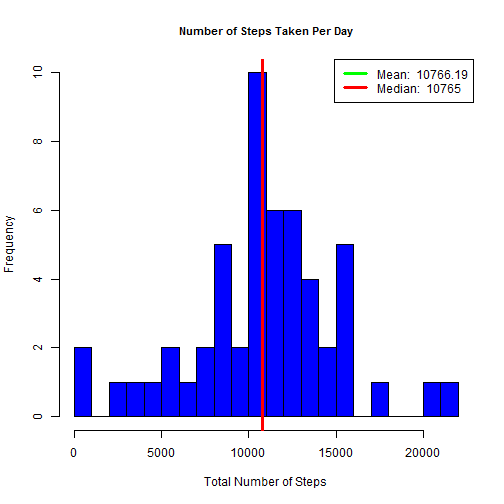
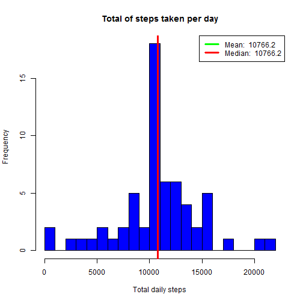

## Introduction

It is now possible to collect a large amount of data about personal movement using activity monitoring devices such as a Fitbit, Nike Fuelband, or Jawbone Up. These type of devices are part of the "quantified self" movement - a group of enthusiasts who take measurements about themselves regularly to improve their health, to find patterns in their behavior, or because they are tech geeks. But these data remain under-utilized both because the raw data are hard to obtain and there is a lack of statistical methods and software for processing and interpreting the data.


## Loading and preprocessing the data

The data for this assignment has be downloaded from the course web site:
  
[Activity monitoring data](https://d396qusza40orc.cloudfront.net/repdata%2Fdata%2Factivity.zip)
The variables included in this dataset are:
  
- steps: Number of steps taking in a 5-minute interval (missing values are coded as NA)
- date: The date on which the measurement was taken in YYYY-MM-DD format
- interval: Identifier for the 5-minute interval in which measurement was taken

The dataset is stored in a comma-separated-value (CSV) file and there are a total of 17,568 observations in this dataset.


```r
setwd("C:/Users/halibe/Desktop/New folder")
data<-read.csv(unz("activity.zip", "activity.csv"),header=TRUE)
data$date<- as.Date(data$date)
```


## What is mean total number of steps taken per day?

For this part of the assignment, you can ignore the missing values in the dataset.

1. Make a histogram of the total number of steps taken each day.
2. Calculate and report the mean and median total number of steps taken per day  

I generalize this histogram plot into a Function to be Re-usable later.

```r
hist_steps = function(x){
  hist(x, breaks = 20, 
       main = 'Number of Steps Taken Per Day', 
       xlab = 'Total Number of Steps', col = 'blue',
       cex.main = .9)
  
  #caluclate mean and median
  mean_steps = round(mean(x), 2)
  median_steps = round(median(x), 2)
  
  #place lines for mean and median on histogram
  abline(v=mean_steps, lwd = 3, col = 'green')
  abline(v=median_steps, lwd = 3, col = 'red')
  
  #create legend
  legend('topright', lty = 1, lwd = 3, col = c("green", "red"),
         cex = 1, 
         legend = c(paste('Mean: ', mean_steps),
                    paste('Median: ', median_steps))
  )
}
newdata<-na.omit(data)
## Calculate the total number of steps taken per day
steps_day<- as.numeric(tapply(newdata$steps, newdata$date, sum))

hist_steps(steps_day)
```

 
The mean and median of total number of steps taken per day are 10766.19 and 10765 respectively.


## What is the average daily activity pattern?
1. Make a time series plot (i.e. type = "l") of the 5-minute interval (x-axis) and the average number of steps taken, averaged across all days (y-axis).
2. Which 5-minute interval, on average across all the days in the dataset, contains the maximum number of steps?


```r
data$interval <- as.factor(data$interval)
steps_avg <- as.numeric(tapply(data$steps, data$interval, mean, na.rm = TRUE))
intervals <- data.frame(intervals = as.numeric(levels(data$interval)), steps_avg)
intervals <- intervals[order(intervals$intervals), ]

##plot the time series

 plot(intervals$interval, intervals$steps_avg, type = 'l',
       main = 'Average Steps in Time Intervals',
       xlab = 'Time Intervals: 5 Minute',
       ylab = 'Average Number of Steps')
## Find Interval That Has The Maximum Avg Steps
steps_max <- intervals[which.max(intervals$steps_avg),]

#Generate Label String
max_lab = paste('Maximum Of ', round(steps_max$steps_avg, 1), '  Steps On \n',
                round(steps_max$intervals, 1) , 'th Time Interval', sep = '')

#Collect Cooridinates of The Max Interval For Graphing
points(steps_max$intervals,steps_max$steps_avg,  col = 'red', lwd = 3, pch = 19)

#Add Label To Annotate Maximum # Steps And Interval
legend("topright",
       legend = max_lab,
       text.col = 'red',
       bty = 'n'
)
```

 
The highest level of activity happens at 835th 5-minute interval with the highest number of steps.


## Imputing missing values

Note that there are a number of days/intervals where there are missing values (coded as NA). The presence of missing days may introduce bias into some calculations or summaries of the data.

1. Calculate and report the total number of missing values in the dataset (i.e. the total number of rows with NAs)

2. Devise a strategy for filling in all of the missing values in the dataset. The strategy does not need to be sophisticated. For example, you could use the mean/median for that day, or the mean for that 5-minute interval, etc.

3. Create a new dataset that is equal to the original dataset but with the missing data filled in.

4. Make a histogram of the total number of steps taken each day and Calculate and report the mean and median total number of steps taken per day. Do these values differ from the estimates from the first part of the assignment? What is the impact of imputing missing data on the estimates of the total daily number of steps?


- the total number of missing values in the dataset:

```r
sum(is.na(data$steps))
```

```
## [1] 2304
```

- the strategy for replacing the missing values in the dataset is to change the “NA"s to the mean values for that 5-minute interval.

```r
steps <- vector()
for (i in 1:dim(data)[1]) {
    if (is.na(data$steps[i])) {
        steps <- c(steps, intervals$steps_avg[intervals$intervals == data$interval[i]])
    } else {
        steps <- c(steps, data$steps[i])
    }
}


nomissing<- data.frame(steps = steps, date = data$date, interval = data$interval)
```
- new dataset that is equal to the original dataset but with the missing data filled in


```r
head(nomissing) 
```

```
##       steps       date interval
## 1 1.7169811 2012-10-01        0
## 2 0.3396226 2012-10-01        5
## 3 0.1320755 2012-10-01       10
## 4 0.1509434 2012-10-01       15
## 5 0.0754717 2012-10-01       20
## 6 2.0943396 2012-10-01       25
```

- Make a histogram of the total number of steps taken each day and so on


```r
# create histogram

hist(tapply(nomissing$steps, nomissing$date, sum), col="blue", xlab = "Total daily steps", breaks = 20, main = "Total of steps taken per day")

total_daily<- as.numeric(tapply(nomissing$steps, nomissing$date, sum))
new_mean_steps = round(mean(total_daily), 1)
new_median_steps = round(median(total_daily), 1)
  
#place lines for mean and median on histogram
abline(v=new_mean_steps, lwd = 3, col = 'green')
abline(v=new_median_steps, lwd = 3, col = 'red')

  legend('topright', lty = 1, lwd = 3, col = c("green", "red"),
         cex = 1, 
         legend = c(paste('Mean: ', new_mean_steps),
                    paste('Median: ', new_median_steps)))
```

 
  
The new mean and median of total number of steps taken per day are 10766 and 10766 respectively, the median is exactly equal to the mean; I belive this is because of the srategy chosen.


## Are there differences in activity patterns between weekdays and weekends?

For this part the weekdays() function may be of some help here. Use the dataset with the filled-in missing values for this part.

1. Create a new factor variable in the dataset with two levels "weekday" and "weekend" indicating whether a given date is a weekday or weekend day.

2. Make a panel plot containing a time series plot (i.e. type = "l") of the 5-minute interval (x-axis) and the average number of steps taken, averaged across all weekday days or weekend days (y-axis). See the README file in the GitHub repository to see an example of what this plot should look like using simulated data.


```r
nomissing$day<- c("weekend", "weekday", "weekday", 
    "weekday", "weekday", "weekday", "weekend")[as.POSIXlt(nomissing$date)$wday + 
    1]
head(nomissing)
```

```
##       steps       date interval     day
## 1 1.7169811 2012-10-01        0 weekday
## 2 0.3396226 2012-10-01        5 weekday
## 3 0.1320755 2012-10-01       10 weekday
## 4 0.1509434 2012-10-01       15 weekday
## 5 0.0754717 2012-10-01       20 weekday
## 6 2.0943396 2012-10-01       25 weekday
```

```r
weekday <- nomissing[nomissing$day ==  "weekday" , ]
weekend <- nomissing[nomissing$day ==  "weekend" , ]
weekday_avg <- as.numeric(tapply(weekday$steps, weekday$interval, mean))
weekend_avg <- as.numeric(tapply(weekend$steps, weekend$interval, mean))

weekday_intervals <- data.frame(intervals = as.numeric(levels(weekday$interval)), weekday_avg)
weekday_intervals <- weekday_intervals[order(weekday_intervals$interval, decreasing = FALSE), ]
weekend_intervals <- data.frame(intervals = as.numeric(levels(weekend$interval)), weekend_avg)
weekend_intervals <- weekend_intervals[order(weekend_intervals$interval, decreasing = FALSE), ]
```

Now, we plot two time series - weekdays and weekends - of the 5-min intervals and average number of steps taken.


```r
 plot(weekday_intervals$interval, weekday_intervals$weekday_avg, type = 'l',
       main = 'Average Steps in Time Intervals (WEEKDAYS)',
       xlab = 'Time Intervals: 5 Minute',
       ylab = 'Average Number of Steps in Weekdays')
```

 

```r
 plot(weekend_intervals$interval, weekend_intervals$weekend_avg, type = 'l',
       main = 'Average Steps in Time Intervals (WEEKENDS)',
       xlab = 'Time Intervals: 5 Minute',
       ylab = 'Average Number of Steps in Weekends')
```

 
    
It seems that in the weekend afternoons (later intervals) the activity (average steps) are higher. 
